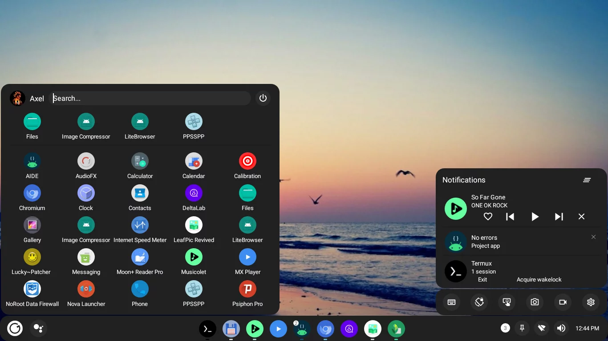

  <h1>Smart Dock</h1>
  A user-friendly desktop mode launcher that offers a modern and customizable user interface

## Main features
- Very customizable, icons, colors, shapes, sounds
- Multi window support
- Keyboard shortcuts
- Support for both desktop and tablet layouts
- Compatible with all Android versions since Lollipop, no root required

## Install

You can grab the latest release from F-Droid

Note: The application should be installed as a system app in order to obtain the right permissions.
Without this functionallity will be limited.

## Usage

### Grante restricted permissions: 
On some devices Accessibility and Notification permissions might not be available. To solve this go to:  System Settings > Apps > Smartdock > 3 Dot menu (Top right corner) > Allow restricted permissions

### Hide Android navigation buttons: 
You should also hide the Android navigation buttons. There are several ways to do this

**With root:**
- From Smart Dock advanced settings
- Edit /system/build.prop and add qemu.hw.mainkeys=1
- Run "echo qemu.hw.mainkeys=1 >> /system/build.prop"

**Without root**
- Mount the system partition on Linux, edit /system/build.prop and add qemu.hw.mainkeys=1  
- For waydroid users, from Linux run waydroid prop set qemu.hw.mainkeys 1

**With LSPosed (might help on Android 11+):**

[See LSPosed](LSPosed.md)

The app uses an accessibility service to capture keyboard input, if that service is crashed you might need to re-enable it and/or restart the system.

## Contributing

[See contributors](Contributors.md)

## Support

Telegram support group: https://t.me/smartdock358
